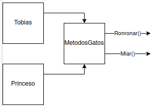

# 3.2 - Prototypes

## Objetos - O retorno
### Construtores
> Construtores são funções especiais que criam e inicializam uma instância de um objeto, retornando o objeto criado no final da execução

```
function FazedoraDeGatos(nome) {
    const novoGato = { 
        nome,
        miar: function() { console.log("Miau")},
    }

    return novoGato
}

let tobias = FazedoraDeGatos("Tobias")
console.log(tobias) // Object { nome: "Tobias" }
```

### Como criar um objeto usando construtores
3. Instanciação funcional:
    - Criamos uma função,
    - Criamos um objeto vazio,
    - Adicionamos métodos e propriedades
    - Retornamos o objeto

Nossa função FazedoraDeGatos do exemplo acima é um construtor com instanciação funcional: todas as propriedades e métodos sao definidos **dentro** do construtor. Vamos criar outro gatinho com ela.

```
let princeso = FazedoraDeGatos("Princeso")
```
A vantagem desse tipo de construtor é que ele é bem fácil de ler, escrever e entender. Mas ele tem duas grandes desvantagens. Primeiro, como tudo é definido dentro do construtor, tudo é duplicado a cada vez que criamos um novo objeto, entulhando a memória.
```
tobias.miar == princeso.miar //false
```
O segundo é que, se no futuro eu quiser atualizar meu construtor ou seus métodos e propriedades, nenhum dos objetos já criados seria atualizável.

4. Instanciação compartilhada funcional
    - Criamos um objeto contento nossos métodos,
    - Criamos a função construtora assim como no exemplo anterior, mas só com propriedades,
    - Estendemos o objeto criado com nossos métodos compartilhados.
Reescrevendo nosso construtor:

```
const metodosGatos = {
    miar: function() { console.log("Miau")},
}

function FazedoraDeGatos(nome) {
    const novoGato = { 
        nome,
    }
    Object.assign(novoGato, metodosGatos)
    return novoGato
}

tobias = FazedoraDeGatos("Tobias")
princeso = FazedoraDeGatos("Princeso")

tobias.miar == princeso.miar // true
```
Compartilhar os métodos resolve o problema de duplicação do exemplo anterior, mas não o de atualização. Além disso, os ponteiros para os métodos são criados quando nosso objeto `metodosGatos` é instanciado. Então, se alterarmos os métodos que ele contém, os métodos dos novos gatinhos apontarão para referências diferentes.


## Prototypes
### Definição de Prototype
> Um prototype é um objeto que é usado por outro objeto como uma fonte "reserva" de propriedades.

Todos os objetos e funções tem uma propriedade automática chamada `prototype`. Nos objetos, essa função não é visível e não pode ser modificada a partir do objeto, apenas sobrescrita. Em funções, essa propriedade é visível e pode ser tanto sobrescrita quanto extendida. **Atenção:** `arrow functions` não possuem seus próprios prototypes.

```
const newObj = {}
console.log(newObj) // consegue ver a propriedade escondida?
```

### Como criar um objeto usando prototypes
5. Instanciação prototipal (Object.create)
    - `Object.create()` usa o objeto passado como argumento da chamada como seu protótipo.

```
const metodosGatos = {
    miar: function() { console.log("Miau")},
}

function FazedoraDeGatos(nome) {
    const novoGato = Object.create(metodosGatos)
    novoGato.nome = nome

    return novoGato
}

tobias = FazedoraDeGatos("Tobias")
princeso = FazedoraDeGatos("Princeso")
```


Com a instanciação prototipal, os métodos passam a ser parte do protótipo do objeto, ao invés de fazer parte do objeto em si. Com isso, podemos adicionar ou alterar métodos no protótipo, e a mudança será refletida em todos os objetos criados. Mas, caso você **altere** um método, seus novos objetos ainda apontarão para uma referência diferente

```
metodosGatos.ronronar = function() {console.log("ron ron ron ron ron")}
tobias.ronronar()
```

6. Instanciação pseudoclássica
A diferença entre a instanciação prototipal e a pseudoclássica é combinamos o uso de `new` com o uso de protótipos. Adicionar `new` na frente da chamada de uma função faz com que ela seja tratada como um construtor. Quando `new` é usado, um objeto é criado, ligado ao valor de `this`, atrelado com o prototype certo e retornado no final da função.

```
function FazedoraDeGatos(nome) {
    this.nome = nome
}

FazedoraDeGatos.prototype.miar = function() { console.log("Miau")}

tobias = new FazedoraDeGatos("Tobias")
princeso = new FazedoraDeGatos("Princeso")
```

7. Instanciação pseudoclássica (ES6 Classes)
Veremos na próxima aula :D

## Vamos voltar para a introdução: conseguimos responder tudo que estava na lista agora?